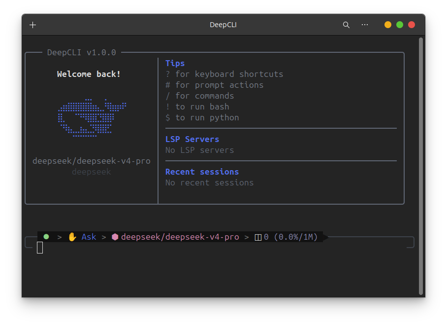

# DeepCLI

<p align="center">
  
  
  
  <a href="LICENSE"></a>
</p>

<p align="center">
  <em>Definitive DeepSeek coding CLI on any OS that grows with you 🐋</em>
</p>

DeepCLI is an open, modular agent harness for the **DeepSeek V4** era with native support for Windows, macOS, and Linux.  Its harness architecture, tool system, and prompt engineering are heavily adapted from Claude Code's codebase, while the TUI is mainly a customized integration of Oh-my-pi; OpenClaw and Hermes Agent inform the multi-agent shape and Python runtime.  It gives coding agents the runtime pieces they need: sessions, tools, memory, skills, permissions, hooks, MCP, provider routing, persistence, and a clean ACP/JSON-RPC boundary between clients and runtime.  The repo is also the experiment: **DeepCLI is being built entirely by AI Coding Agents**.  Every kernel capability is a replaceable subsystem, so memory, skills, tools, LLM providers, permissions, hooks, gateways, storage, and even the agent loop can be swapped, extended, or rebuilt without coupling frontends to kernel internals.  The project documentation is open too, making the architecture easier to understand and giving different contributors a shared map for sustained agent-driven development.

<p align="center">
  
</p>

## Architecture

```text
Clients
  CLI / Probe / IDE / future Home Screen / custom frontend
    |
    | ACP + JSON-RPC over WebSocket
    v
DeepCLI Kernel
  transport -> protocol -> session -> orchestrator
                                |
                                v
       LLM routing / tools / skills / MCP / memory / hooks
                                |
                                v
                 authz / config / persistence / gateways
```

Active code lives under `src/`:

- `src/kernel/` - the Mustang kernel, a FastAPI runtime for sessions, orchestration, tools, providers, memory, and protocol handling.
- `src/cli/` - a thin TypeScript/Bun ACP client.
- `src/probe/` - an interactive and automated ACP test client.
- `archive/` - old daemon-era reference code; not active development.

## Quick Start

DeepCLI is still alpha software.  Linux is the first supported install target. From a local checkout, build and install the current repo into your user layout:

```bash
git clone <repo-url> deepcli
cd deepcli
./install-dev.sh
```

Then start DeepCLI:

```bash
deepcli
```

The `deepcli` launcher keeps the Kernel as a per-user singleton.  It checks for an existing ready Kernel, starts one in the background when needed, chooses `127.0.0.1:8200` by default, and falls back to a free port if the default is already occupied.

Useful launcher commands:

```bash
deepcli status
deepcli stop
deepcli restart
deepcli kernel logs
deepcli --resume <session-id>
deepcli --uninstall
```

If `~/.local/bin` is not already on your shell `PATH`, add it after install:

```bash
export PATH="$HOME/.local/bin:$PATH"
```

For source-only development without installing, use:

```bash
scripts/run-cli.sh
```

That script ensures a dev Kernel is ready and forwards CLI arguments, including `--resume`, `--port`, and `--kernel`.

## Development

For first-time setup, read [`INIT.md`](INIT.md).  For project rules, architecture, workflow, and current progress, start with [`docs/README.md`](docs/README.md).

Useful commands:

```bash
uv run pytest tests/ -q
./resolve-ref.sh claude-code
./resolve-ref.sh openclaw
./resolve-ref.sh hermes-agent
```

## Status

DeepCLI is in alpha.  Kernel 1.0.0 is online with ACP transport, SQLite-backed sessions, tool authorization, LLM provider routing, skills, hooks, memory, MCP, gateways, and the Agent Control Plane groundwork.

The current source of truth for active work is [`docs/plans/progress.md`](docs/plans/progress.md).

## License

[MIT](LICENSE) - Copyright (c) 2026 Haolei (Saki) Ye.
